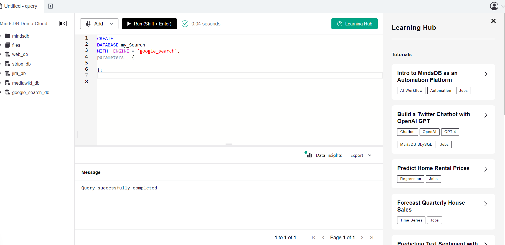
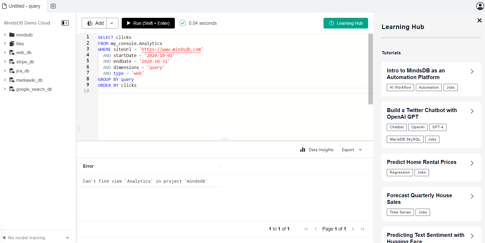
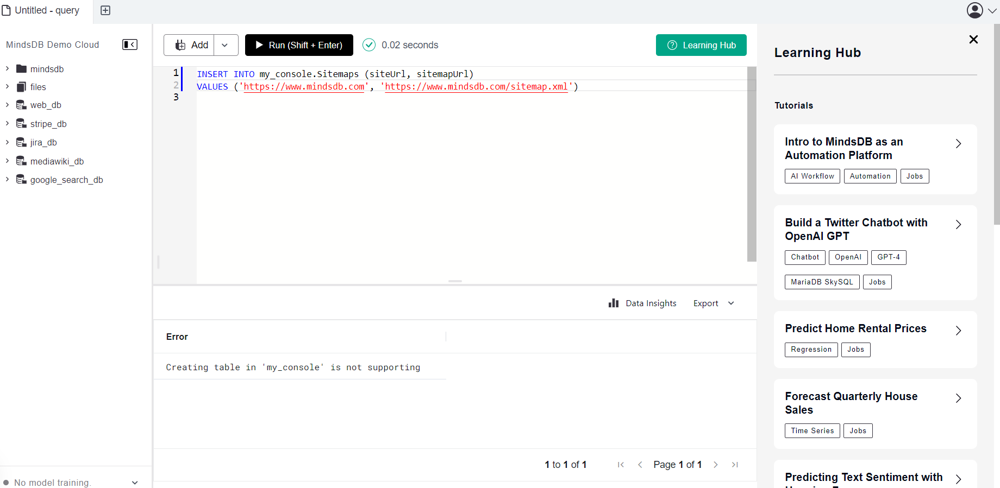
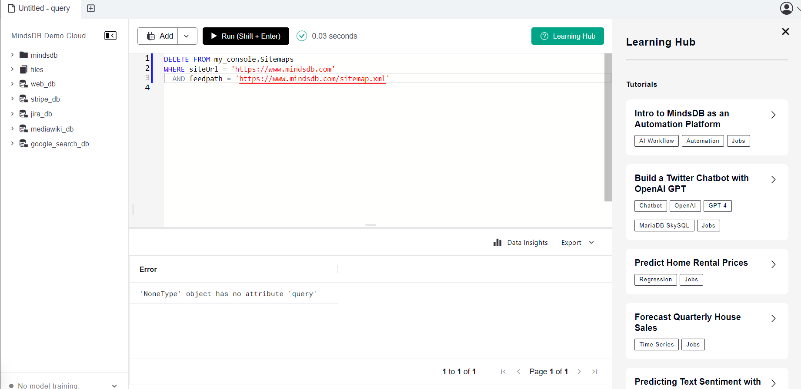
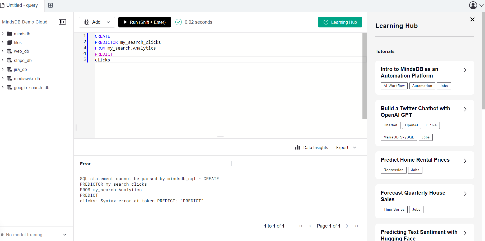

# Testing Google Search Integration

This README provides instructions for testing the Google Search integration in MindsDB.

For more details, refer to the related [GitHub Issue](https://github.com/mindsdb/mindsdb/issues/8118).

## Test Cases MindsDB Google Search

**Description:**
### 1. This creates a database called google_search_db. 

```
CREATE
DATABASE my_Search
WITH  ENGINE = 'google_search',
parameters = {
    
};    


```
**Screeshot Result: Query successfull**



-----

### 1. This creates a database called google_search_db. 

```
CREATE
DATABASE my_Search
WITH  ENGINE = 'google_search',
parameters = {
    
};    


```
**Screeshot Result: Query successfull**


-----
### 2. you can get traffic data for a specific site

```
CREATE
DATABASE my_Search
WITH  ENGINE = 'google_search',
parameters = {
    
};    


```
**Screeshot Result: Query successfull**



-----

### 3. you can  test by submitting a sitemap to Google Search Console.

```
INSERT INTO my_console.Sitemaps (siteUrl, sitemapUrl)
VALUES ('https://www.mindsdb.com', 'https://www.mindsdb.com/sitemap.xml')

```
**Screeshot Result: Query Failed**



-----

### 4.You can Delete a sitemap from Google Search Console

```
DELETE FROM my_console.Sitemaps
WHERE siteUrl = 'https://www.mindsdb.com'
  AND feedpath = 'https://www.mindsdb.com/sitemap.xml'

```

**Screeshot Result:  Failed**



-----

### 5.you can incorporate external data from Google Search within our ML models.

```
CREATE
PREDICTOR my_search_clicks
FROM my_search.Analytics
PREDICT
clicks

```


-----

**Screeshot Result:  Failed**

## Result
The Google_search integration has been  tested, and some test cases are working as Failing.